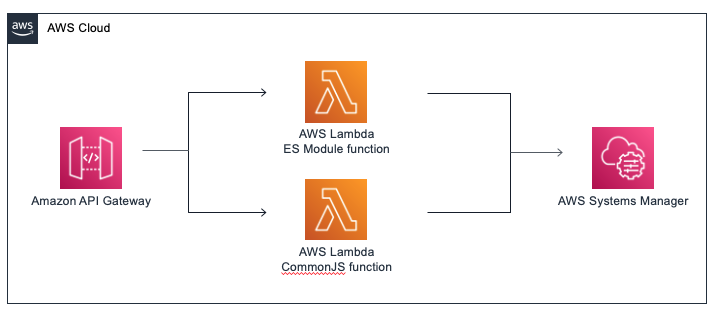
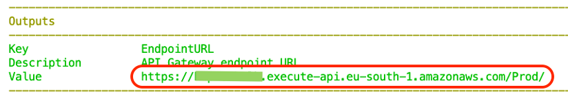

# Lambda ES Module Performance Benchmarking

This project demonstrates how to perform benchmark testing to understand the impact of using top-level await in conjunction with provisioned concurrency.

When a Lambda function scales out, the allocation and initialization of new resources may create increased latency for end users. Lambda provisioned concurrency was created to give customers more control over their performance by enabling them to schedule in advance the creation of runtime environments.

In addition to creating runtime environments, provisioned concurrency also performs initialization tasks defined by customers. Customer initialization code can perform a variety of tasks including importing libraries and dependencies, retrieving secrets and configurations, and initializing connections to other services. According to our analysis of Lambda product usage, customer initialization code is the largest contributor to cold start latency. 

# Performing benchmark testing
You can perform benchmark tests to measure the impact of top-level await. This project contains two AWS Lambda functions, one that contains an ES Module and one that contains a CommonJS function. These functions are configured to respond to an API Gateway event source. Both functions retrieve a parameter from AWS Systems Manager parameter store and are configured to use provisioned concurrency. The ES module uses top-level await to retrieve the parameter.

Before deploying the solution, you need:
- An AWS account ([sign up for an account](https://portal.aws.amazon.com/gp/aws/developer/registration/index.html?nc2=h_ct&src=header_signup) if you don’t have one).
- The [AWS SAM CLI](https://docs.aws.amazon.com/serverless-application-model/latest/developerguide/serverless-sam-cli-install.html) installed.
- [Node.js installed](https://nodejs.org/en/download/) (version 14 minimum).

To deploy:
1.	From a terminal window, clone the GitHub repo:
`git clone https://github.com/aws-samples/aws-lambda-es-module-performance-benchmark`
2.	Change directory:
`cd ./aws-lambda-es-module-performance-benchmark`
3.	Build application:
`sam build`
4.	Deploy the application to your AWS account (deploying provisioned concurrency may take a few minutes to complete):
`sam deploy –-guided`

5.	Take note of the API Gateway URL in the Outputs section.

 
I use a popular open source tool [artillery](https://artillery.io/) to provide load testing. 

To perform load tests:
1.	Open config.yaml document in the /load_test directory and replace the target string with the URL of the API Gateway:
target: “Put API Gateway url string here”
2.	From a terminal window, navigate to the /load_test directory:
`cd load_test`
3.	Download and install dependencies:
`npm install`
4.	Begin load test for the CommonJS function. 
- `./test_commonjs.sh`
- `test_commonjs.sh` (Windows users)
5.	Begin load test for ES module function. 
- `./test_esmodule.sh`
- `test_esmodule.sh` (Windows users)
6. Note the differences in the p99 latency to compare cold start performance.

# Cleaning up
To delete the sample application, use the latest version of the AWS SAM CLI and run:
`sam delete`
